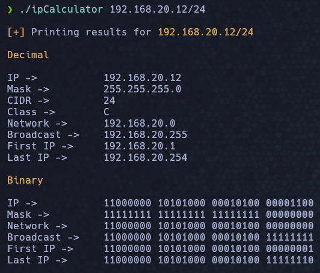

# IP Calculator

Este script programado en c y permite sacar toda la información de una ip como la dirección de red, dirección broadcast, clase de la red...

Uso
----
```bash
./ipCalculator {ip}/{máscara}

#Ejemplo

./ipCalculator 192.168.20.12/24
```
Captura
----

